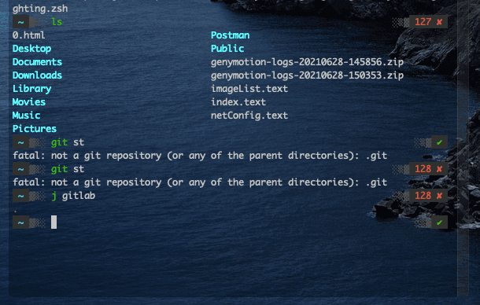

## 写在前面

优化一下当前的终端界面，码代码的心情更好，而且结合 Oh My Zsh 安装相关插件可以提高效率，本文主要 iTerm2 + Oh My Zsh + Powerlevel10k ,xianshagn 先上一张效果图 

## 安装 iTerm2

[安装](https://iterm2.com/)

## 安装 Oh My Zsh

可以做很多定制化的处理，丰富的主题和插件

[安装](https://ohmyz.sh/)

### 安装 Powerlevel10k

比较好用的主题

[安装](https://github.com/romkatv/powerlevel10k/)

### 常用插件

```
plugins=(
  git
  github
  autojump
  zsh-syntax-highlighting
  zsh-autosuggestions
)
```
